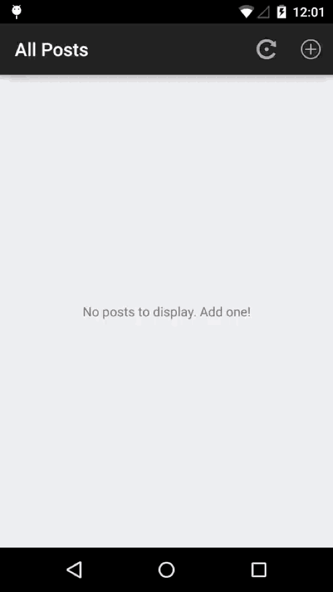

# MaxLeap-Sample-PostList-Android

## Overview

PostList is a sample of MaxLeap SDK, and it relies on the basic module of MaxLeap. This app shows the permission management and login operation based on MaxLeap SDK.

## Effect

## How to Use

1. Open Android Studio or IDEA, click `File -> Open `, select and import `setting.gradle`.
2. Open `App.java` and replace the defined constants with your own `APP Id` and `API KEY`.
